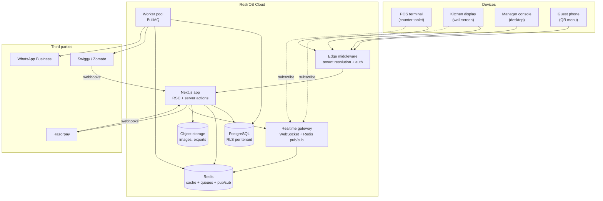
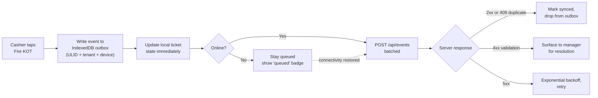

# RestrOS — Architecture

> Status: design document for the production build. The prototype in
> `prototype/` implements the front-end half of this document with static JSON
> standing in for the API.

---

## 1. What the architecture has to survive

Restaurant software fails in specific, predictable ways. The architecture is
shaped by these five constraints more than by any technology preference.

| Constraint | Consequence for the design |
| --- | --- |
| **The counter cannot stop.** A dropped connection during a dinner rush must not stop order taking. | The POS is offline-first: an IndexedDB outbox with idempotent replay, not an online-only form. |
| **Latency is felt, not measured.** A cashier taps four times a second. 300ms of round trip is a queue at the till. | Order entry is local-first and optimistic. The server confirms; it does not gate. |
| **Two tenants must never see each other's rows.** This is existential, not a feature. | Isolation is enforced in PostgreSQL with row-level security, not in application `where` clauses. |
| **The kitchen display is a second screen with no keyboard.** | Realtime push is a first-class transport, not polling bolted on later. |
| **Money and tax must reconcile exactly.** | Monetary values are integer paise. Orders are an append-only event log with derived read models. |

---

## 2. System context



---

## 3. Technology choices

| Layer | Choice | Why this, not the alternative |
| --- | --- | --- |
| Framework | **Next.js 15+ (App Router)** | Server Components remove most client data fetching from report-heavy screens; server actions give mutations without a hand-rolled API layer; the same codebase serves marketing, console and guest surfaces. |
| Language | **TypeScript, `strict`** | Non-negotiable at this domain complexity. Prisma generates the types the API and UI both consume, so a schema change breaks the build rather than production. |
| Database | **PostgreSQL 16** | Chosen over MySQL specifically for **row-level security**, which lets tenant isolation be a database guarantee instead of a code-review promise. Also: `jsonb` with GIN indexes for menu snapshots, partial indexes, `generated always as`, and window functions the reporting layer leans on. |
| ORM | **Prisma** | Type-safe queries and a migration story the team can review. Its RLS gap is closed explicitly — see §6.3. |
| Styling | **Design tokens + CSS Modules** | The token layer already exists (`tokens.css`) and is the contract between operator and guest surfaces. CSS Modules keep component styles co-located without a utility-class dialect in the markup. *Alternative considered:* Tailwind v4's `@theme` could consume the same tokens; rejected because the POS/KDS markup is dense and generated, and utility strings hurt readability there more than they help. |
| Realtime | **Self-hosted WebSocket gateway + Redis pub/sub** | Ticket fan-out is small, ordered and tenant-scoped. A hosted service (Ably/Pusher) adds per-message cost and a second auth model for a problem Redis already solves. |
| Jobs | **BullMQ on Redis** | Redis is already in the stack for pub/sub and cache. Queues are sharded by tenant so one busy tenant cannot starve the rest. |
| Auth | **Auth.js (email + OAuth) and a separate PIN flow** | Managers authenticate as people. Counter staff authenticate as a *shift on a device* — a different threat model that deserves a different mechanism (§8.2). |
| Hosting | **Vercel or a container platform + managed Postgres** | The app is stateless; the WS gateway and workers are long-lived and deploy as containers. |

### 3.1 Why not MySQL

The brief listed MySQL or PostgreSQL. PostgreSQL wins on one decisive point:
**row-level security**. In MySQL, tenant isolation must be expressed as a
`WHERE tenant_id = ?` in every query, which means a single forgotten clause is a
cross-tenant data leak that no test is guaranteed to catch. In PostgreSQL the
policy lives on the table and is enforced on the connection — application bugs
degrade to "no rows" rather than "someone else's rows".

Secondary reasons: `jsonb` for immutable menu snapshots on orders, partial and
expression indexes for the "open tickets" hot path, and materialised views for
daily reporting rollups.

---

## 4. Repository layout

A pnpm workspace monorepo. Turborepo for task orchestration and caching.

```
restros/
├── apps/
│   ├── web/                  Next.js — marketing, console, guest menu
│   ├── realtime/             WebSocket gateway (Node + ws + Redis)
│   └── worker/               BullMQ consumers
├── packages/
│   ├── db/                   Prisma schema, migrations, tenant-scoped client
│   ├── core/                 Domain logic: pricing, tax, KOT routing, loyalty
│   ├── contracts/            Zod schemas + tRPC routers, shared by all apps
│   ├── ui/                   Component library built on the design tokens
│   ├── tokens/               tokens.css + a TS export of the same values
│   └── config/               eslint, tsconfig, prettier presets
└── prototype/                This repository's clickable front-end
```

`packages/core` holds every rule that must not be re-implemented per surface:
how a bill is totalled, how GST is backed out of a tax-inclusive price, which
station a line routes to, how loyalty points accrue. The POS, the guest menu and
the aggregator adapter all call the same functions.

---

## 5. Front-end architecture

### 5.1 The prototype (what is in this repo)

Deliberately dependency-free, so the design and the interaction model can be
judged without a toolchain in the way.

```
prototype/assets/
├── css/
│   ├── tokens.css        Layer 1-3: primitives → semantics → component knobs
│   ├── base.css          Reset, element defaults, utilities
│   ├── components.css    The pattern library
│   ├── shell.css         Console chrome
│   ├── pages.css         Screens with a shape of their own
│   └── app.css           @import entry point (bundled in production)
├── js/
│   ├── core.js           DOM, formatting, storage, theme, toasts, data loader
│   ├── shell.js          Sidebar, topbar, command palette — rendered from a nav config
│   ├── charts.js         Five hand-rolled SVG chart primitives
│   └── <screen>.js       One ES module per screen
└── icons/sprite.svg      101 symbols, referenced by <use>
```

Three rules hold the prototype together:

1. **Nothing below `tokens.css` hard-codes a colour or a size.** Theming is a
   values swap, never a structural one.
2. **Navigation is data.** `NAV` in `shell.js` feeds the sidebar, the command
   palette and (in production) plan-based feature gating.
3. **Screens are thin.** Each HTML file is a skeleton; its module fetches JSON
   and renders. That maps one-to-one onto the production split between a route
   and its server component.

### 5.2 The production front-end

| Concern | Approach |
| --- | --- |
| **Reads** | React Server Components. Reports, orders, inventory and settings never ship their data-fetching code to the browser. |
| **Mutations** | Server actions wrapped in a `withTenant()` helper that opens an RLS-scoped transaction and writes the audit row. |
| **Client islands** | Only where interaction is genuinely local: the POS ticket, the KDS board, the command palette, the floor plan, the guest cart. |
| **State** | Zustand for POS ticket state (survives navigation, serialises to the outbox). React Query only where a client island polls or subscribes. |
| **Forms** | React Hook Form + the Zod schemas from `packages/contracts`, so client and server validate against one definition. |
| **Routing** | `app/(marketing)`, `app/(auth)`, `app/[tenant]/(console)`, `app/[tenant]/guest`. The tenant segment is resolved in middleware, not read from the URL by each page. |

### 5.3 Performance budgets

Enforced in CI with Lighthouse CI on four representative routes.

| Route | LCP | INP | CLS | JS shipped |
| --- | --- | --- | --- | --- |
| Marketing `/` | ≤ 1.8s | ≤ 200ms | ≤ 0.05 | ≤ 90 kB |
| Console dashboard | ≤ 2.0s | ≤ 200ms | ≤ 0.05 | ≤ 140 kB |
| **POS terminal** | ≤ 1.5s | **≤ 100ms** | ≤ 0.02 | ≤ 180 kB |
| Guest QR menu | ≤ 1.5s | ≤ 200ms | ≤ 0.05 | ≤ 70 kB |

The POS gets the strictest interaction budget because it is the only screen
where a human taps faster than they read.

---

## 6. Multi-tenancy

### 6.1 The model

**One database, one schema, shared tables, `tenant_id` on every row, enforced by
row-level security.**

Alternatives and why they lost:

| Model | Verdict |
| --- | --- |
| Database per tenant | Strongest isolation, but migrations across thousands of databases become the main engineering cost, and cross-tenant analytics stops being possible. |
| Schema per tenant | Same migration problem at a smaller scale; PostgreSQL degrades with tens of thousands of schemas. |
| **Shared tables + RLS** | **Chosen.** One migration, one connection pool, cheap fleet analytics, and isolation enforced by the database rather than by discipline. |
| Shared tables, app-level filtering only | Rejected. One forgotten `where` clause is a breach. |

Large or regulated tenants can be **moved to a dedicated database** later
without a schema change, because the tenancy column already exists everywhere.

### 6.2 Tenant resolution

```mermaid
sequenceDiagram
    participant B as Browser
    participant M as Edge middleware
    participant A as Server action / RSC
    participant P as PostgreSQL

    B->>M: GET adda-khana.restros.in/orders
    M->>M: parse subdomain → slug
    M->>M: verify session cookie; check membership of slug
    M->>A: forward with x-tenant-id + x-user-id headers
    A->>P: BEGIN; SET LOCAL app.tenant_id = '…'
    P-->>A: rows visible to this tenant only
    A-->>B: rendered HTML / action result
```

Tenants are addressed by subdomain (`adda-khana.restros.in`), with custom
domains supported on Scale. Middleware resolves the slug to a tenant id, checks
that the session's user is a member, and rejects before any query runs.

### 6.3 Making RLS work with Prisma

Prisma does not natively set session variables per query. The gap is closed with
an explicit wrapper — the only sanctioned way to reach tenant data:

```ts
// packages/db/src/tenant.ts
export async function withTenant<T>(
  tenantId: string,
  fn: (tx: Prisma.TransactionClient) => Promise<T>,
): Promise<T> {
  return prisma.$transaction(async (tx) => {
    // set_config(..., true) scopes the value to this transaction, so a pooled
    // connection can never leak it into the next request.
    await tx.$executeRaw`SELECT set_config('app.tenant_id', ${tenantId}, true)`;
    return fn(tx);
  });
}
```

Three defences sit on top of it:

1. **A CI lint rule** fails the build on any `prisma.<tenantModel>.` call outside
   `withTenant`. Non-tenant models (`Tenant`, `Plan`, `PlatformAuditLog`) are
   allow-listed by name.
2. **An integration test** per tenant table asserts that a query under tenant A
   returns zero rows created by tenant B.
3. **The application role has no `BYPASSRLS`.** Migrations run as a separate
   role; the runtime role cannot escape a policy even by accident.

### 6.4 Feature gating

Plan entitlements (`outlets`, `seats`, module list) live on the tenant row.
Gating is checked in three places, and all three are required: the navigation
config hides the entry, the route guard rejects the request, and the server
action re-checks before it writes. The UI is a convenience; the server is the
control.

---

## 7. Data and consistency

### 7.1 Orders are an event log

An order's lifecycle is stored as append-only `OrderEvent` rows —
`created`, `line_added`, `line_voided`, `kot_fired`, `line_ready`, `settled`,
`refunded` — with the `Order` row acting as a derived read model updated in the
same transaction.

This buys three things restaurants specifically need:

- **Audit for free.** "Who voided the Chilli Chicken at 18:55, and when?" is a
  query, not a forensics exercise.
- **Safe offline replay.** Events carry a client-generated ULID; replaying a
  queued event twice is a no-op.
- **Correct reporting.** Yesterday's numbers cannot change because someone
  edited a menu price today (see §7.2).

### 7.2 Menus are versioned and snapshotted

Publishing creates an immutable `MenuVersion`. Every order line stores a
**`jsonb` snapshot** of the item as it was sold: name, price, portion, tax rate,
station. A price rise never rewrites history, and a reprinted bill from three
months ago still shows what the guest actually paid.

### 7.3 Money

Every monetary column is `INTEGER` **paise**. No floats anywhere in the money
path. Formatting to `₹` happens once, at the display edge.

Menu prices are **tax-inclusive** (as printed on the card), so GST is backed
out rather than added on:

```
taxable = round(gross * 100 / (100 + rate))
gst     = gross − taxable
cgst    = floor(gst / 2)
sgst    = gst − cgst          // the odd paisa goes to SGST, deterministically
```

Rounding is applied once per line, then summed — never applied to a sum — so a
bill's lines always add to its total.

---

## 8. Security

### 8.1 Threat model, briefly

The realistic threats are, in order: a cross-tenant data leak; an insider
(staff) voiding sales to steal cash; a stolen counter tablet; and credential
stuffing against owner accounts. The design spends its effort there.

### 8.2 Two authentication models

| | Manager / owner | Counter & kitchen staff |
| --- | --- | --- |
| Identity | A person, with an email | A **shift on a known device** |
| Credential | Password (Argon2id) or OAuth, TOTP MFA available | 4-digit PIN, rate-limited, only valid on a device registered to the outlet |
| Session | 30 days, rotating refresh, httpOnly + `SameSite=Lax` | Expires at shift end or after 20 minutes idle |
| Rationale | Full access needs a real identity | A PIN typed at a counter in front of guests must not be a password, and must be useless on any other device |

A stolen tablet is therefore worth a shift, not an account — and the device can
be revoked from Settings without changing anyone's password.

### 8.3 Authorisation

A capability-based policy layer (`packages/core/policy`). Roles map to
capability sets (`order.void`, `menu.publish`, `billing.manage`) — the exact
matrix rendered on the Staff & Roles screen. Checks are scoped to
`(tenant, outlet, capability)` and run server-side on every mutation.

### 8.4 Data protection

- Guest PII (phone, email, name) is encrypted at rest with a **per-tenant data
  encryption key**, wrapped by a platform KMS key. A single leaked key exposes
  one tenant.
- Card data never touches RestrOS servers — Razorpay hosted flows and tokens
  only. This keeps PCI scope at SAQ-A.
- Audit rows are append-only; the runtime role has `INSERT` and `SELECT` on
  audit tables and nothing else.
- Deleting a workspace erases tenant rows within 30 days; encrypted backups age
  out within 90.

---

## 9. Realtime

```mermaid
sequenceDiagram
    participant POS
    participant API as Server action
    participant DB as PostgreSQL
    participant R as Redis
    participant GW as WS gateway
    participant KDS

    POS->>API: fireKot(orderId)
    API->>DB: BEGIN; insert OrderEvent; update read model; COMMIT
    API->>R: PUBLISH tenant:t_adda:outlet:main {kot.fired}
    R-->>GW: message
    GW-->>KDS: {type:"kot.fired", ticket:{…}}
    KDS->>KDS: prepend ticket, start timer
```

- Channels are `tenant:{id}:outlet:{id}:{topic}`. The gateway authorises a
  subscription against the session's memberships before joining; a client can
  never subscribe its way into another tenant.
- Events are published **after commit**, never inside the transaction, so a
  rolled-back order cannot appear on the pass.
- Every event carries a monotonic `seq`. A client that detects a gap refetches
  the current state rather than trying to patch it.
- Fallback: if the socket is down for more than 10 seconds the KDS polls
  `GET /api/kds/tickets` every 5 seconds and shows a degraded-mode badge.

---

## 10. Offline-first POS

The single most important reliability feature, and the one most POS products
get wrong.



Rules that make this safe:

- **Idempotency by construction.** Every event has a client-generated ULID; the
  server's `UNIQUE (tenant_id, client_event_id)` makes a replay a no-op that
  returns `409` and is treated as success.
- **What works offline:** taking orders, printing KOTs to LAN printers, cash
  settlement, and the local menu (cached from the last published version).
- **What does not:** card and UPI payments, aggregator orders, loyalty
  redemption. These are disabled with a visible reason rather than failing at
  the moment of payment.
- **Bounded staleness.** After 24 hours offline the terminal warns; after 72
  hours it stops accepting new orders. An indefinitely offline till is a
  reconciliation problem, not a feature.
- **Conflict rule.** Order events are per-device and append-only, so they do not
  conflict. Menu and stock are server-authoritative and simply overwrite the
  local cache on reconnect.

---

## 11. Background work

| Queue | Work | Cadence |
| --- | --- | --- |
| `aggregator` | Push menu on publish, pull orders, mirror 86 state | Event-driven, ≤ 30s to reflect |
| `notifications` | WhatsApp/SMS receipts, campaign sends | Event-driven, rate-limited per tenant |
| `reports` | Nightly rollups into materialised views, day-end close | 04:00 tenant-local (the business-day boundary) |
| `inventory` | Depletion from recipes, par-level checks, PO drafting | On order settle, plus a nightly sweep |
| `exports` | CSV/GSTR-1 generation to object storage | On demand |

Every job is sharded by tenant with a per-tenant concurrency cap, so a chain
with twelve outlets cannot monopolise workers during another tenant's rush.
Failures retry with exponential backoff and land in a dead-letter queue that
raises an alert on the platform console.

---

## 12. Caching

| Layer | What | Invalidation |
| --- | --- | --- |
| CDN | Marketing pages, static assets, guest menu HTML | Tag-based purge on menu publish |
| Next.js data cache | Published menu, outlet settings, plan entitlements | `revalidateTag('menu:{tenant}')` on publish |
| Redis | Session lookups, rate-limit counters, hot report aggregates | TTL, plus explicit bust on write |
| Client | Menu in IndexedDB for the POS; `localStorage` for UI preferences | Version stamp compared on reconnect |

Live order state is **never cached**. It is read from the primary or pushed over
the socket. Everything else can be stale for a few seconds; the pass cannot.

---

## 13. Observability

- **OpenTelemetry** traces from middleware through server action to query, with
  `tenant_id` and `outlet_id` as span attributes so a slow tenant is findable.
- **Structured JSON logs**, `tenant_id` on every line, PII redacted at the
  serialiser rather than by convention.
- **Sentry** for errors and session replay on the console (replay disabled on
  the guest surface for privacy).
- **SLOs:** 99.9% availability for order write; p95 order-write latency under
  400ms; realtime delivery under 1s at p95. Error budget burn pages on-call.
- **Business alerts, not just technical ones:** a terminal offline for over an
  hour during service hours, a KDS with no bump in 20 minutes, or an aggregator
  sync failure are all incidents even when every server is healthy.

---

## 14. Testing

| Level | Tool | What it must cover |
| --- | --- | --- |
| Unit | Vitest | `packages/core`: tax rounding, bill totalling, KOT routing, loyalty accrual, prep-time targets |
| Contract | Zod + tRPC snapshot tests | Every input/output schema; breaking changes fail the build |
| Integration | Vitest + Testcontainers (real PostgreSQL) | **RLS isolation per table**, migration up/down, event replay idempotency |
| E2E | Playwright | Take an order → fire KOT → bump on KDS → settle → verify the report; the offline queue-and-replay path with the network cut |
| Visual | Playwright screenshots | Design-system components in light and dark, at three widths |
| Accessibility | axe-core in Playwright | Zero criticals on every console route and the guest menu |
| Load | k6 | 200 concurrent terminals across 50 tenants at dinner-rush write rates |

The RLS isolation test is the one that must never be skipped or quarantined.

---

## 15. Environments and delivery

| Environment | Purpose | Data |
| --- | --- | --- |
| `local` | Development | Docker Compose: Postgres, Redis; seeded from `prototype/data` |
| `preview` | One per pull request | Branch database, anonymised seed |
| `staging` | Release candidate, integration sandboxes | Anonymised production-shaped data |
| `production` | Live | Real |

CI on every pull request: typecheck → lint → unit → integration (Testcontainers)
→ build → E2E on preview → Lighthouse budgets → axe. Merges to `main` deploy to
staging automatically; production is a manual promotion of the same artefact.

Migrations run as a separate step before the app deploys, and must be
**backwards compatible for one release** — expand, deploy, migrate data,
contract — so a rollback never strands the schema ahead of the code.

---

## 16. Decision record

| # | Decision | Alternative | Rationale |
| --- | --- | --- | --- |
| 1 | PostgreSQL with RLS | MySQL | Tenant isolation as a database guarantee, not a code convention |
| 2 | Shared tables + `tenant_id` | Database or schema per tenant | One migration path; fleet analytics stays possible |
| 3 | Next.js App Router + server actions | SPA + separate REST API | Fewer moving parts; reports never ship their queries to the client |
| 4 | Event-sourced orders | CRUD on an orders table | Audit, offline replay, and reports that do not change retroactively |
| 5 | `jsonb` menu snapshot per line | Foreign key to the menu item | Price history stays correct without a bitemporal schema |
| 6 | Integer paise | Decimal or float | No rounding drift anywhere in the money path |
| 7 | Self-hosted WS + Redis | Ably / Pusher / Supabase Realtime | Small tenant-scoped fan-out; avoids a second auth model and per-message cost |
| 8 | Offline-first POS | Online-only with a retry banner | The counter cannot stop; this is the product's core reliability claim |
| 9 | Separate PIN auth for staff | One login for everyone | A PIN typed in front of guests must not be worth an account |
| 10 | Design tokens + CSS Modules | Tailwind v4 | Dense generated markup (POS, KDS) reads better without utility strings |

---

## 17. What is deliberately out of scope for v1

Named here so that "we forgot" is never confused with "we decided":

- Table-side card terminals and integrated EMV hardware.
- Central kitchen and inter-outlet stock transfers (planned for Phase 6).
- Payroll. Shift and attendance data is exported, not processed.
- Multi-currency. Every tenant in v1 is INR, and the money layer assumes a
  single currency per tenant — this is the assumption most expensive to revisit,
  and it is recorded deliberately.
- A native mobile app. The console and guest menu are responsive web; the POS
  runs as an installable PWA.
