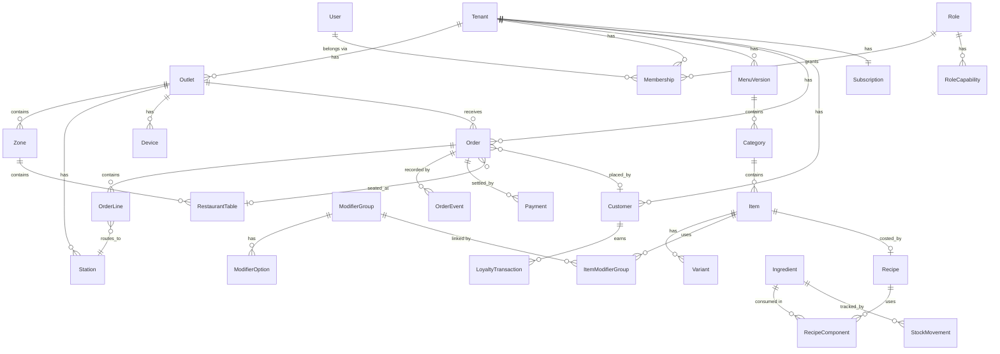

# RestrOS — Data Model

PostgreSQL 16 + Prisma. One database, shared tables, `tenantId` on every
tenant-scoped row, isolation enforced by row-level security.

See [ARCHITECTURE.md](ARCHITECTURE.md) §6 for why this model was chosen over
database-per-tenant or schema-per-tenant.

---

## 1. Conventions

| Rule | Detail |
| --- | --- |
| Identifiers | `cuid2` for entities. Client-generated **ULID** for events, because ULIDs sort by time and make offline replay ordering trivial. |
| Money | `Int`, always **paise**. Never `Float`, never `Decimal`. A `₹110.00` item is `11000`. |
| Timestamps | `timestamptz`, always UTC. The outlet's timezone and business-day boundary are applied at the read edge. |
| Soft delete | `archivedAt` on catalogue entities (items, categories, staff). Orders are **never** deleted — they are voided, which is an event. |
| Tenant column | Every tenant-scoped table has `tenantId` and a composite index leading with it. |
| Naming | Prisma models `PascalCase`; database tables `snake_case` via `@@map`. |

---

## 2. Entity map



---

## 3. Schema

### 3.1 Platform and tenancy

```prisma
model Tenant {
  id            String   @id @default(cuid())
  slug          String   @unique               // adda-khana → adda-khana.restros.in
  name          String
  customDomain  String?  @unique
  country       String   @default("IN")
  currency      String   @default("INR")       // single currency per tenant in v1
  status        TenantStatus @default(TRIALING)
  brandPrimary  String   @default("#0E3B2E")
  brandAccent   String   @default("#D8402A")
  logoUrl       String?
  createdAt     DateTime @default(now())
  archivedAt    DateTime?

  outlets       Outlet[]
  memberships   Membership[]
  subscription  Subscription?
  menuVersions  MenuVersion[]

  @@map("tenants")
}

enum TenantStatus { TRIALING ACTIVE PAST_DUE SUSPENDED CHURNED }

model Plan {
  id          String  @id @default(cuid())
  code        String  @unique                  // starter | growth | scale | enterprise
  name        String
  pricePaise  Int?                             // null = quoted
  maxOutlets  Int?                             // null = unlimited
  maxSeats    Int?
  modules     String[]                         // ["pos","kds","menu","inventory",…]
  isPublic    Boolean @default(true)

  subscriptions Subscription[]
  @@map("plans")
}

model Subscription {
  id                 String   @id @default(cuid())
  tenantId           String   @unique
  planId             String
  status             SubStatus @default(TRIALING)
  currentPeriodEnd   DateTime
  trialEndsAt        DateTime?
  extraOutlets       Int      @default(0)
  providerCustomerId String?                    // Razorpay customer
  providerSubId      String?

  tenant Tenant @relation(fields: [tenantId], references: [id], onDelete: Cascade)
  plan   Plan   @relation(fields: [planId], references: [id])
  @@map("subscriptions")
}

enum SubStatus { TRIALING ACTIVE PAST_DUE CANCELLED }

model Outlet {
  id           String  @id @default(cuid())
  tenantId     String
  name         String
  address      String?
  phone        String?
  gstin        String?
  timezone     String  @default("Asia/Kolkata")
  // Sales after midnight belong to the previous business date. 04:00 local
  // is the boundary for a restaurant that closes at 23:30.
  dayStartsAt  String  @default("04:00")
  opensAt      String  @default("11:00")
  closesAt     String  @default("23:00")
  seats        Int     @default(0)
  isDefault    Boolean @default(false)
  archivedAt   DateTime?

  tenant Tenant @relation(fields: [tenantId], references: [id], onDelete: Cascade)
  zones  Zone[]
  orders Order[]

  @@unique([tenantId, name])
  @@index([tenantId, archivedAt])
  @@map("outlets")
}
```

### 3.2 People and access

```prisma
model User {
  id           String   @id @default(cuid())
  email        String   @unique
  name         String
  passwordHash String?                          // Argon2id; null for OAuth-only
  totpSecret   String?
  emailVerified DateTime?
  createdAt    DateTime @default(now())

  memberships  Membership[]
  @@map("users")
}

/// A user's access to one tenant, optionally narrowed to specific outlets.
model Membership {
  id         String   @id @default(cuid())
  tenantId   String
  userId     String
  roleId     String
  outletIds  String[]                           // empty = every outlet
  pinHash    String?                            // 4-digit POS PIN, Argon2id
  status     MemberStatus @default(INVITED)
  invitedAt  DateTime @default(now())
  lastActiveAt DateTime?

  tenant Tenant @relation(fields: [tenantId], references: [id], onDelete: Cascade)
  user   User   @relation(fields: [userId], references: [id], onDelete: Cascade)
  role   Role   @relation(fields: [roleId], references: [id])

  @@unique([tenantId, userId])
  @@index([tenantId, status])
  @@map("memberships")
}

enum MemberStatus { INVITED ACTIVE SUSPENDED }

model Role {
  id          String  @id @default(cuid())
  tenantId    String?                           // null = system role, shared
  code        String                            // owner | manager | cashier | waiter | kitchen
  name        String
  description String?
  isSystem    Boolean @default(false)

  memberships  Membership[]
  capabilities RoleCapability[]

  @@unique([tenantId, code])
  @@map("roles")
}

model RoleCapability {
  roleId     String
  capability String                             // "order.void", "menu.publish", …
  role       Role @relation(fields: [roleId], references: [id], onDelete: Cascade)

  @@id([roleId, capability])
  @@map("role_capabilities")
}

/// A registered terminal. A PIN is only valid on a device bound to the outlet,
/// so a stolen tablet is worth a shift, not an account.
model Device {
  id         String  @id @default(cuid())
  tenantId   String
  outletId   String
  name       String
  kind       DeviceKind
  fingerprint String  @unique
  lastSeenAt DateTime?
  revokedAt  DateTime?

  @@index([tenantId, outletId])
  @@map("devices")
}

enum DeviceKind { POS KDS PRINTER TABLET }

model AuditLog {
  id         String   @id @default(cuid())
  tenantId   String
  outletId   String?
  actorId    String?
  action     String                             // "order.void", "menu.publish"
  subjectType String
  subjectId  String
  detail     Json
  severity   Severity @default(INFO)
  ip         String?
  at         DateTime @default(now())

  @@index([tenantId, at(sort: Desc)])
  @@index([tenantId, action, at(sort: Desc)])
  @@map("audit_logs")
}

enum Severity { INFO NOTICE WARNING DANGER }
```

### 3.3 Menu

The catalogue is versioned. Publishing creates a new immutable `MenuVersion`;
nothing that has been sold against is ever mutated.

```prisma
model MenuVersion {
  id          String   @id @default(cuid())
  tenantId    String
  version     Int
  status      MenuStatus @default(DRAFT)
  publishedAt DateTime?
  publishedBy String?
  note        String?

  categories Category[]
  tenant     Tenant @relation(fields: [tenantId], references: [id], onDelete: Cascade)

  @@unique([tenantId, version])
  @@index([tenantId, status])
  @@map("menu_versions")
}

enum MenuStatus { DRAFT PUBLISHED ARCHIVED }

model Category {
  id            String  @id @default(cuid())
  tenantId      String
  menuVersionId String
  name          String                          // "Starters"
  subtitle      String?                         // "Veg" / "Non-Veg"
  slug          String
  dietary       Dietary @default(MIXED)
  sort          Int     @default(0)
  /// Momo sells as steam / fry / pan-fry. The axis lives on the category so
  /// every item in it shares one variant vocabulary.
  variantAxis   Json?

  items Item[]
  @@index([tenantId, menuVersionId, sort])
  @@map("categories")
}

enum Dietary { VEG NON_VEG MIXED }

model Item {
  id          String  @id @default(cuid())
  tenantId    String
  categoryId  String
  name        String
  portion     String?                           // "8 pc", "4 stick"
  /// NULL is a real, expected state: the printed card left 11 prices blank.
  /// pendingPrice makes that visible instead of pretending it is ₹0.
  pricePaise  Int?
  pendingPrice Boolean @default(false)
  isVeg       Boolean @default(false)
  stationId   String?
  prepMins    Int     @default(10)
  tags        String[]
  isAvailable Boolean @default(true)
  outOfStockReason String?
  isDraft     Boolean @default(false)
  /// Handwritten margin notes read from a scanned card. Never auto-applied.
  annotation  Json?
  sort        Int     @default(0)
  archivedAt  DateTime?

  category  Category @relation(fields: [categoryId], references: [id], onDelete: Cascade)
  variants  Variant[]
  modifiers ItemModifierGroup[]
  recipe    Recipe?
  overrides ItemOutletOverride[]

  @@index([tenantId, categoryId, sort])
  @@index([tenantId, isAvailable])
  @@map("items")
}

model Variant {
  id         String @id @default(cuid())
  tenantId   String
  itemId     String
  code       String                             // steam | fry | panfry
  name       String
  pricePaise Int
  sort       Int    @default(0)

  item Item @relation(fields: [itemId], references: [id], onDelete: Cascade)
  @@unique([itemId, code])
  @@map("variants")
}

model ModifierGroup {
  id       String @id @default(cuid())
  tenantId String
  name     String                               // "Spice level", "Add-ons"
  minSelect Int   @default(0)
  maxSelect Int   @default(1)

  options ModifierOption[]
  items   ItemModifierGroup[]
  @@map("modifier_groups")
}

model ModifierOption {
  id         String @id @default(cuid())
  tenantId   String
  groupId    String
  name       String
  pricePaise Int    @default(0)
  sort       Int    @default(0)

  group ModifierGroup @relation(fields: [groupId], references: [id], onDelete: Cascade)
  @@map("modifier_options")
}

model ItemModifierGroup {
  itemId  String
  groupId String
  item    Item          @relation(fields: [itemId],  references: [id], onDelete: Cascade)
  group   ModifierGroup @relation(fields: [groupId], references: [id], onDelete: Cascade)
  @@id([itemId, groupId])
  @@map("item_modifier_groups")
}

/// Per-outlet price and availability. A mall outlet charges more than the
/// neighbourhood one without forking the whole menu.
model ItemOutletOverride {
  itemId      String
  outletId    String
  tenantId    String
  pricePaise  Int?
  isAvailable Boolean?

  item Item @relation(fields: [itemId], references: [id], onDelete: Cascade)
  @@id([itemId, outletId])
  @@map("item_outlet_overrides")
}

model Station {
  id       String @id @default(cuid())
  tenantId String
  outletId String
  code     String                               // wok | fry | tandoor | rice | cold | cha
  name     String
  color    String
  printerId String?

  @@unique([outletId, code])
  @@map("stations")
}
```

### 3.4 Floor

```prisma
model Zone {
  id       String @id @default(cuid())
  tenantId String
  outletId String
  name     String
  sort     Int    @default(0)

  outlet Outlet @relation(fields: [outletId], references: [id], onDelete: Cascade)
  tables RestaurantTable[]
  @@map("zones")
}

model RestaurantTable {
  id       String @id @default(cuid())
  tenantId String
  zoneId   String
  code     String                               // "T3", "M1", "TR2"
  seats    Int
  shape    TableShape @default(SQUARE)
  x        Float                                // 0-100 grid, so the plan scales
  y        Float
  status   TableStatus @default(AVAILABLE)
  note     String?

  zone   Zone    @relation(fields: [zoneId], references: [id], onDelete: Cascade)
  orders Order[]

  @@unique([tenantId, code])
  @@index([tenantId, status])
  @@map("restaurant_tables")
}

enum TableShape { SQUARE ROUND RECT }
enum TableStatus { AVAILABLE OCCUPIED BILLED DIRTY RESERVED BLOCKED }

model Reservation {
  id        String @id @default(cuid())
  tenantId  String
  outletId  String
  tableId   String?
  guestName String
  phone     String
  pax       Int
  at        DateTime
  status    ReservationStatus @default(CONFIRMED)
  note      String?

  @@index([tenantId, outletId, at])
  @@map("reservations")
}

enum ReservationStatus { CONFIRMED SEATED WAITLIST NO_SHOW CANCELLED }
```

### 3.5 Orders — the heart of the system

```prisma
model Order {
  id           String @id @default(cuid())
  tenantId     String
  outletId     String
  /// Human-facing, unique per outlet per business date: ORD-2497.
  code         String
  kotCode      String
  businessDate DateTime @db.Date
  channel      Channel
  status       OrderStatus @default(NEW)
  tableId      String?
  guests       Int?
  serverId     String?
  customerId   String?

  // Every figure in paise, computed once by packages/core and stored.
  subtotalPaise   Int @default(0)
  discountPaise   Int @default(0)
  packingPaise    Int @default(0)
  taxablePaise    Int @default(0)
  cgstPaise       Int @default(0)
  sgstPaise       Int @default(0)
  totalPaise      Int @default(0)
  commissionPaise Int @default(0)              // aggregator cut, informational

  placedAt   DateTime @default(now())
  readyAt    DateTime?
  settledAt  DateTime?
  prepMins   Int?
  rating     Int?

  /// The external order id when this came from Swiggy/Zomato.
  externalRef String?

  outlet   Outlet          @relation(fields: [outletId], references: [id])
  table    RestaurantTable? @relation(fields: [tableId], references: [id])
  customer Customer?       @relation(fields: [customerId], references: [id])
  lines    OrderLine[]
  events   OrderEvent[]
  payments Payment[]

  @@unique([tenantId, outletId, businessDate, code])
  @@unique([tenantId, channel, externalRef])
  @@index([tenantId, outletId, businessDate])
  @@index([tenantId, status, placedAt])
  // The KDS hot path: open tickets only. A partial index keeps it tiny.
  @@index([tenantId, outletId, placedAt], map: "idx_open_tickets")
  @@map("orders")
}

enum Channel { DINE_IN TAKEAWAY DELIVERY QR SWIGGY ZOMATO }
enum OrderStatus { NEW PREPARING READY SERVED PAID CANCELLED }

model OrderLine {
  id         String @id @default(cuid())
  tenantId   String
  orderId    String
  itemId     String?                            // nullable: the item may be archived later
  /// Immutable copy of the item as sold: name, portion, price, variant,
  /// modifiers, tax rate, station. A price change tomorrow cannot rewrite
  /// what this guest actually paid.
  snapshot   Json
  qty        Int
  unitPaise  Int
  modifiersPaise Int @default(0)
  totalPaise Int
  stationId  String?
  status     LineStatus @default(PENDING)
  voidedAt   DateTime?
  voidReason String?
  note       String?

  order Order @relation(fields: [orderId], references: [id], onDelete: Cascade)
  @@index([tenantId, orderId])
  @@index([tenantId, stationId, status])
  @@map("order_lines")
}

enum LineStatus { PENDING FIRED READY SERVED VOIDED }

/// Append-only. The order row above is a read model derived from these.
model OrderEvent {
  id            String @id                       // ULID, generated on the client
  tenantId      String
  orderId       String
  /// The idempotency key. A replayed offline event hits this constraint and
  /// is treated as success, so a flaky network never doubles an order.
  clientEventId String
  deviceId      String?
  actorId       String?
  type          String                           // created | line_added | kot_fired | settled …
  payload       Json
  seq           BigInt  @default(autoincrement()) // monotonic; clients detect gaps
  occurredAt    DateTime                          // when it happened on the device
  recordedAt    DateTime @default(now())          // when the server accepted it

  order Order @relation(fields: [orderId], references: [id], onDelete: Cascade)

  @@unique([tenantId, clientEventId])
  @@index([tenantId, orderId, seq])
  @@map("order_events")
}

model Payment {
  id          String @id @default(cuid())
  tenantId    String
  orderId     String
  method      PaymentMethod
  amountPaise Int
  status      PaymentStatus @default(CAPTURED)
  providerRef String?
  tenderedPaise Int?                             // cash given
  changePaise   Int?
  at          DateTime @default(now())

  order Order @relation(fields: [orderId], references: [id], onDelete: Cascade)
  @@index([tenantId, at])
  @@map("payments")
}

enum PaymentMethod { CASH UPI CARD WALLET AGGREGATOR DUE }
enum PaymentStatus { PENDING CAPTURED FAILED REFUNDED }
```

### 3.6 Inventory

```prisma
model Ingredient {
  id          String @id @default(cuid())
  tenantId    String
  outletId    String
  name        String
  unit        String                             // kg | litre | pc | pack
  parLevel    Decimal @db.Decimal(12, 3)
  onHand      Decimal @db.Decimal(12, 3) @default(0)
  unitCostPaise Int
  supplierId  String?
  stationId   String?
  lastCountedAt DateTime?

  components RecipeComponent[]
  movements  StockMovement[]

  @@unique([tenantId, outletId, name])
  @@index([tenantId, outletId])
  @@map("ingredients")
}

model Recipe {
  id        String @id @default(cuid())
  tenantId  String
  itemId    String @unique
  yieldQty  Decimal @db.Decimal(10, 3) @default(1)

  item       Item @relation(fields: [itemId], references: [id], onDelete: Cascade)
  components RecipeComponent[]
  @@map("recipes")
}

model RecipeComponent {
  recipeId     String
  ingredientId String
  tenantId     String
  qty          Decimal @db.Decimal(12, 4)

  recipe     Recipe     @relation(fields: [recipeId], references: [id], onDelete: Cascade)
  ingredient Ingredient @relation(fields: [ingredientId], references: [id])
  @@id([recipeId, ingredientId])
  @@map("recipe_components")
}

/// Append-only ledger; Ingredient.onHand is the derived balance.
model StockMovement {
  id           String @id @default(cuid())
  tenantId     String
  ingredientId String
  kind         MovementKind
  qty          Decimal @db.Decimal(12, 4)       // signed
  reason       String?
  refType      String?                           // "order" | "purchase_order" | "count"
  refId        String?
  actorId      String?
  at           DateTime @default(now())

  ingredient Ingredient @relation(fields: [ingredientId], references: [id])
  @@index([tenantId, ingredientId, at(sort: Desc)])
  @@map("stock_movements")
}

enum MovementKind { RECEIPT DEPLETION WASTAGE COUNT_ADJUSTMENT TRANSFER }

model Supplier {
  id       String @id @default(cuid())
  tenantId String
  name     String
  phone    String?
  email    String?
  @@map("suppliers")
}

model PurchaseOrder {
  id         String @id @default(cuid())
  tenantId   String
  outletId   String
  supplierId String
  code       String
  status     POStatus @default(DRAFT)
  totalPaise Int      @default(0)
  expectedAt DateTime?
  note       String?
  createdAt  DateTime @default(now())

  @@unique([tenantId, code])
  @@map("purchase_orders")
}

enum POStatus { DRAFT SENT PARTIAL RECEIVED CANCELLED }
```

### 3.7 Customers and loyalty

```prisma
model Customer {
  id          String @id @default(cuid())
  tenantId    String
  /// Encrypted at rest with a per-tenant DEK wrapped by the platform KMS key.
  phone       String
  phoneHash   String                             // blind index for exact lookup
  name        String?
  email       String?
  isVeg       Boolean @default(false)
  marketingOptIn Boolean @default(false)
  note        String?
  visits      Int     @default(0)
  lifetimeSpendPaise Int @default(0)
  points      Int     @default(0)
  tier        String  @default("new")
  firstSeenAt DateTime @default(now())
  lastSeenAt  DateTime?

  orders       Order[]
  loyaltyTxns  LoyaltyTransaction[]

  @@unique([tenantId, phoneHash])
  @@index([tenantId, lastSeenAt])
  @@map("customers")
}

model LoyaltyTransaction {
  id         String @id @default(cuid())
  tenantId   String
  customerId String
  orderId    String?
  points     Int                                 // signed: earn positive, redeem negative
  reason     String
  at         DateTime @default(now())

  customer Customer @relation(fields: [customerId], references: [id], onDelete: Cascade)
  @@index([tenantId, customerId, at(sort: Desc)])
  @@map("loyalty_transactions")
}

model Segment {
  id       String @id @default(cuid())
  tenantId String
  name     String
  /// A structured predicate compiled to a parameterised SQL fragment.
  /// Never raw SQL from user input.
  rule     Json
  @@map("segments")
}
```

---

## 4. Row-level security

Applied to **every** table carrying `tenant_id`. Written once as a migration
helper and applied uniformly — a table without a policy is a failing test, not
a code-review conversation.

```sql
-- migrations/0002_rls.sql
CREATE OR REPLACE FUNCTION current_tenant_id() RETURNS text AS $$
  SELECT nullif(current_setting('app.tenant_id', true), '')
$$ LANGUAGE sql STABLE;

DO $$
DECLARE t text;
BEGIN
  FOREACH t IN ARRAY ARRAY[
    'outlets','memberships','menu_versions','categories','items','variants',
    'modifier_groups','modifier_options','item_outlet_overrides','stations',
    'zones','restaurant_tables','reservations','orders','order_lines',
    'order_events','payments','ingredients','recipes','recipe_components',
    'stock_movements','suppliers','purchase_orders','customers',
    'loyalty_transactions','segments','devices','audit_logs'
  ] LOOP
    EXECUTE format('ALTER TABLE %I ENABLE ROW LEVEL SECURITY', t);
    EXECUTE format('ALTER TABLE %I FORCE ROW LEVEL SECURITY', t);
    EXECUTE format($p$
      CREATE POLICY tenant_isolation ON %I
        USING (tenant_id = current_tenant_id())
        WITH CHECK (tenant_id = current_tenant_id())
    $p$, t);
  END LOOP;
END $$;

-- The runtime role can never see around a policy.
ALTER ROLE restros_app NOBYPASSRLS;
```

`FORCE ROW LEVEL SECURITY` matters: without it the table owner silently bypasses
its own policies, which is exactly the account an ORM tends to connect as.

`WITH CHECK` matters equally: `USING` alone would prevent reading another
tenant's rows while still permitting an `INSERT` that *creates* one.

**Audit tables** get an additional policy denying `UPDATE` and `DELETE` to the
runtime role, so history is append-only in the database rather than by
convention.

---

## 5. Indexing

Driven by the four queries that dominate load:

| Query | Index |
| --- | --- |
| Open tickets for a KDS station | `order_lines (tenant_id, station_id, status)` partial `WHERE status IN ('FIRED','PENDING')` |
| Today's orders for an outlet | `orders (tenant_id, outlet_id, business_date)` |
| Guest lookup by phone at billing | `customers (tenant_id, phone_hash)` unique |
| Item search in the POS | `items` GIN on `to_tsvector('simple', name)`, plus a `pg_trgm` index for fuzzy match |

Every tenant-scoped index **leads with `tenant_id`**. Under RLS the planner sees
the tenant predicate on every query, so a leading tenant column keeps scans
proportional to one tenant's data rather than the whole table.

---

## 6. Reporting

Order and line tables are the write path and stay lean. Reporting reads from
materialised views refreshed nightly per tenant by the `reports` queue, plus a
live path for today.

```sql
CREATE MATERIALIZED VIEW mv_daily_sales AS
SELECT tenant_id, outlet_id, business_date,
       count(*)                                        AS orders,
       sum(total_paise)                                AS gross_paise,
       sum(discount_paise)                             AS discount_paise,
       sum(cgst_paise + sgst_paise)                    AS gst_paise,
       sum(commission_paise)                           AS commission_paise,
       sum(coalesce(guests, 1))                        AS covers,
       round(avg(total_paise))                         AS aov_paise,
       round(avg(prep_mins)::numeric, 1)               AS avg_prep_mins
FROM orders
WHERE status IN ('PAID', 'SERVED')
GROUP BY tenant_id, outlet_id, business_date;

CREATE UNIQUE INDEX ON mv_daily_sales (tenant_id, outlet_id, business_date);
```

The unique index enables `REFRESH MATERIALIZED VIEW CONCURRENTLY`, so a refresh
never blocks a reader mid-service.

Item-level mix is derived from `order_lines.snapshot->>'name'` rather than a
join to `items`, so an archived or renamed item still reports correctly under
the name it was sold as.

---

## 7. Migrations

- `prisma migrate` for schema; hand-written SQL for RLS policies, materialised
  views and data backfills.
- Every migration is **expand → deploy → backfill → contract**, across at least
  two releases, so a rollback never leaves the schema ahead of the code.
- Destructive operations (`DROP COLUMN`, `NOT NULL` on an existing column) require
  an explicit reviewer approval label on the pull request.
- Migrations run as `restros_migrate`, a role distinct from the runtime role.
- Every migration is tested against a restored production-shaped snapshot in
  staging before it is promoted.

---

## 8. Mapping the prototype's JSON to the schema

The demo files are shaped to make this correspondence obvious:

| Prototype file | Models |
| --- | --- |
| `menu.json` | `MenuVersion`, `Category`, `Item`, `Variant`, `ModifierGroup`, `ModifierOption`, `Station` |
| `orders.json` | `Order`, `OrderLine` (with its `snapshot`), `Payment` |
| `floor.json` | `Outlet`, `Zone`, `RestaurantTable`, `Reservation` |
| `staff.json` | `User`, `Membership`, `Role`, `RoleCapability`, `AuditLog` |
| `inventory.json` | `Ingredient`, `Recipe`, `RecipeComponent`, `PurchaseOrder`, `StockMovement` |
| `customers.json` | `Customer`, `Segment`, `LoyaltyTransaction` |
| `tenants.json` | `Tenant`, `Plan`, `Subscription` |
| `analytics.json` | `mv_daily_sales` and the live reporting queries |

`prototype/data/_seed.mjs` becomes `packages/db/seed.ts` largely unchanged — the
same generator, writing rows instead of files.
