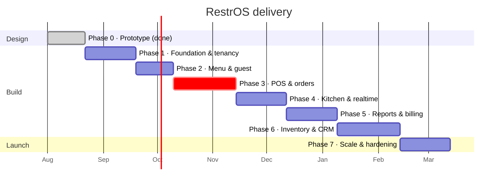

# RestrOS — Delivery Plan

> A phase-by-phase plan with explicit exit criteria. Every phase ends in
> something a real restaurant could use, not in a layer that only makes sense
> once the next layer arrives.

**Legend:** `[x]` done in this repository · `[ ]` planned

---

## Sequencing principle

Restaurant software is only adoptable if it replaces something on day one. So
the order is driven by **what a restaurant can stop doing**, not by what is
architecturally convenient:

1. Take an order and print a bill → replaces the billing machine.
2. Show it in the kitchen → replaces the paper KOT spike.
3. Tell the owner what happened → replaces the notebook.
4. Everything else.

The database, auth and tenancy work is front-loaded into Phase 1 because
retrofitting row-level security onto a live schema is the single most expensive
mistake available.

---

## Phase 0 — Discovery, design and prototype ✅

**Goal:** prove the interaction model and settle the design language before any
production code exists.
**Duration:** 3 weeks · **Status: complete (this repository)**

- [x] Transcribe a real menu card into structured data (`prototype/data/menu.json`)
- [x] Identify the awkward truths in real menu data — blank prices, handwritten
      margin notes, variant axes — and design *for* them rather than around them
- [x] Name and positioning (`README.md` § Why "RestrOS")
- [x] Design system: OKLCH token layer, type scale, spacing, elevation, motion
- [x] Icon set — 101 hand-built SVG symbols in one sprite, no icon font
- [x] Component library: buttons, badges, cards, tables, forms, drawers, modals,
      toasts, command palette, charts
- [x] Living style guide (`prototype/styleguide.html`)
- [x] Marketing site + tenant provisioning wizard + two auth models
- [x] Operator console — 13 screens, wired to demo data
- [x] POS terminal with variants, modifiers, discounts, KOT routing, settlement
- [x] Kitchen display with station rails, age colouring and bump/recall
- [x] Guest QR menu driven by the same `menu.json`
- [x] Platform console demonstrating the multi-tenant control plane
- [x] Deterministic demo-data generator (`prototype/data/_seed.mjs`)
- [x] Static checks: JS parse, JSON parse, asset paths, icon references
- [x] Architecture, data model, API and design-system documentation

**Exit criteria — all met**

- A cashier can complete an order in the prototype without instruction.
- Every screen renders from real transcribed data with no placeholder text.
- The design system documents itself and every token is used, not decorative.

---

## Phase 1 — Foundation and tenancy

**Goal:** a deployable, empty, provably isolated multi-tenant application.
**Duration:** 4 weeks · **The phase that must not be rushed.**

### Infrastructure
- [ ] pnpm workspace + Turborepo; `apps/web`, `packages/{db,core,contracts,ui,tokens,config}`
- [ ] Docker Compose for local Postgres 16 + Redis
- [ ] CI: typecheck → lint → test → build, on every pull request
- [ ] Preview environment per pull request with a branch database
- [ ] Sentry, OpenTelemetry and structured logging wired before the first feature

### Data and isolation
- [ ] Prisma schema: `Tenant`, `Outlet`, `User`, `Membership`, `Role`, `Plan`, `AuditLog`
- [ ] `tenant_id` on every tenant-scoped table, with the composite indexes
- [ ] **RLS policies on every tenant table**; runtime role without `BYPASSRLS`
- [ ] `withTenant()` transaction wrapper as the only route to tenant data
- [ ] CI lint rule failing any tenant-model query outside `withTenant`
- [ ] Integration test per table proving tenant A cannot read tenant B

### Auth and access
- [ ] Auth.js: email + password (Argon2id), OAuth, optional TOTP
- [ ] Subdomain tenant resolution in middleware, with membership check
- [ ] Capability-based policy layer; the six system roles seeded
- [ ] Audit log writing on every privileged mutation

### Shell
- [ ] Port the design tokens into `packages/tokens`
- [ ] Port the console shell — sidebar, topbar, command palette — into `packages/ui`
- [ ] Marketing site and login live on the real stack

**Exit criteria**

- Two tenants exist; a signed-in user of one gets zero rows from the other, and
  the test that proves it runs on every pull request.
- Provisioning a tenant is one command and takes under 30 seconds.
- Deploying to production is a button, and rolling back is another.

---

## Phase 2 — Menu and the guest surface

**Goal:** the catalogue that every later phase depends on.
**Duration:** 3 weeks

- [ ] `MenuVersion`, `Category`, `Item`, `Variant`, `ModifierGroup`, `ModifierOption`
- [ ] Immutable publish flow with version history and one-click rollback
- [ ] **`pendingPrice` as a first-class state** — visible in the console, hidden
      from guests, unsellable in the POS
- [ ] Availability toggle (86) with an outlet scope and an auto-clear at open
- [ ] Menu manager UI: inline edit, drag reorder, bulk price change
- [ ] Import: CSV/Excel with column mapping; photo import behind a flag
- [ ] Guest QR menu on the real stack, per-table QR generation
- [ ] Per-outlet price overrides
- [ ] Menu cached at the edge; publish purges by tag

**Exit criteria**

- Publishing a price change reaches the guest menu in under 5 seconds.
- An item without a price cannot be sold or shown to a guest anywhere.
- A published version can be rolled back without data loss.

---

## Phase 3 — POS and orders (the first replacement)

**Goal:** a restaurant can stop using its old billing machine.
**Duration:** 5 weeks · **The highest-risk phase.**

- [ ] `Order`, `OrderLine`, `OrderEvent`, `Payment` with the `jsonb` line snapshot
- [ ] Integer-paise money layer; tax-inclusive GST back-out with per-line rounding
- [ ] POS terminal: search, category rail, variants, modifiers, notes
- [ ] Order types: dine-in, takeaway, delivery; table and cover assignment
- [ ] Discounts with a capability check and a mandatory reason
- [ ] Split bill (by line and by cover), merge tickets, move table
- [ ] Payments: cash, UPI (Razorpay dynamic QR), card, "due"
- [ ] Thermal printing: 80mm bill + per-station KOT, ESC/POS over LAN
- [ ] GST-compliant bill with GSTIN, HSN and a tax breakdown
- [ ] Void and refund with approval, reason and audit
- [ ] Till: open float, cash drop, close with a variance report
- [ ] **Offline mode**: service worker, IndexedDB outbox, ULID idempotency, replay
- [ ] Orders ledger with the detail drawer and reprint

**Exit criteria**

- 100 consecutive orders with zero rupee of drift between lines, bill and report.
- The network can be cut mid-service; orders continue, print, and reconcile
  exactly on reconnect, verified by an automated Playwright run.
- A duplicate replayed event never creates a second order.

---

## Phase 4 — Kitchen, tables and realtime

**Goal:** the pass and the floor come online.
**Duration:** 4 weeks

- [ ] WebSocket gateway with tenant-scoped channel authorisation
- [ ] Redis pub/sub fan-out; publish strictly after commit; monotonic `seq`
- [ ] Kitchen display: station rails, age colouring, bump, recall, line strike-off
- [ ] Station routing rules per item, with course firing
- [ ] 86 from the KDS propagating to POS, guest menu and aggregators
- [ ] Floor plan editor and live table map
- [ ] Reservations and waitlist with SMS/WhatsApp confirmation
- [ ] Table lifecycle: seat → order → bill → clear, with turn-time tracking
- [ ] Degraded mode: polling fallback and a visible badge when the socket drops

**Exit criteria**

- KOT to KDS in under 1 second at p95 with 50 concurrent outlets.
- Killing the WebSocket gateway degrades to polling with no lost tickets.
- An item 86'd in the kitchen disappears from the guest menu within 30 seconds.

---

## Phase 5 — Reporting, staff and billing (the SaaS becomes a business)

**Goal:** owners can run the business, and RestrOS can charge for it.
**Duration:** 4 weeks

- [ ] Nightly rollups into materialised views; business-day boundary honoured
- [ ] Sales reports: trend, hour of day, weekday profile, category and item mix
- [ ] **Channel profitability after aggregator commission**
- [ ] Payment mix and settlement reconciliation
- [ ] Ticket-time distribution and station bottleneck analysis
- [ ] GSTR-1 export; Tally/Zoho journal export
- [ ] Staff management, invitations, POS PINs, device registration
- [ ] Role and capability matrix UI; custom roles
- [ ] Shifts, clock in/out, per-server sales attribution
- [ ] Subscription billing: plans, entitlements, proration, dunning
- [ ] Platform console: tenant health, MRR, provisioning, audited impersonation

**Exit criteria**

- Every reported figure reconciles to the order ledger to the paisa.
- A plan downgrade that exceeds a limit is blocked with a clear explanation
  rather than silently breaking a feature.
- Support can enter a tenant, and the tenant can see that it happened.

---

## Phase 6 — Inventory, CRM and integrations

**Goal:** the margin and retention story.
**Duration:** 5 weeks

- [ ] Ingredients, units, suppliers, par levels, stock counts with variance
- [ ] Recipes tying ingredients to items; automatic depletion on settle
- [ ] Food-cost and dish-margin reporting
- [ ] Purchase orders with auto-draft at par breach; goods receipt
- [ ] Wastage logging with reason codes
- [ ] Customer profiles, visit history, preferences and allergy notes
- [ ] Loyalty: points accrual and redemption, tiers
- [ ] Segments compiled to SQL; campaigns over WhatsApp and SMS with consent
- [ ] Feedback capture on the digital bill
- [ ] Swiggy and Zomato: menu push, order pull, availability mirroring
- [ ] Webhooks and a scoped public API (Scale plan)

**Exit criteria**

- Stock depletes correctly against a day of real orders, within 2% variance.
- An aggregator order lands in the POS and the KDS indistinguishably from a
  dine-in order, with its commission visible on the line.
- A guest can be found by phone number in under 200ms.

---

## Phase 7 — Scale, hardening and launch

**Goal:** ready for a thousand tenants rather than ten.
**Duration:** 4 weeks

- [ ] Load test: 200 concurrent terminals across 50 tenants at rush write rates
- [ ] Query audit; add the indexes the load test proves are missing
- [ ] Read replica for reporting; primary reserved for the write path
- [ ] Per-tenant rate limits and job concurrency caps
- [ ] Security review and third-party penetration test
- [ ] Accessibility audit — WCAG 2.2 AA on every console route and the guest menu
- [ ] Backup and restore drill, with a documented and *practised* RTO/RPO
- [ ] Runbooks: aggregator outage, printer failure, stuck queue, tenant restore
- [ ] Onboarding: in-product tour, help centre, migration tooling from common POS exports
- [ ] Status page and incident communication process

**Exit criteria**

- p95 order-write latency under 400ms at target load.
- A restore from backup completed within the stated RTO, by someone who did not
  write the runbook.
- Zero critical accessibility findings.

---

## Timeline

Roughly **8 months** from the end of Phase 0 to general availability, with a
pilot restaurant live on Phase 3 output at around month four. That pilot is not
optional: everything after Phase 3 should be shaped by a real kitchen using it.

---

## Team

| Role | Phases 1–3 | Phases 4–7 |
| --- | --- | --- |
| Tech lead / full-stack | 1 | 1 |
| Full-stack engineers | 2 | 3 |
| Front-end engineer (POS/KDS focus) | 1 | 1 |
| Designer | 0.5 | 0.5 |
| QA / automation | 0.5 | 1 |
| Product / domain | 0.5 | 0.5 |

---

## Risks

| Risk | Likelihood | Impact | Mitigation |
| --- | --- | --- | --- |
| Offline sync produces duplicate or lost orders | Medium | **Critical** | ULID idempotency + `UNIQUE (tenant_id, client_event_id)`; automated network-cut E2E in CI from Phase 3 onward |
| Cross-tenant leak | Low | **Critical** | RLS in the database, CI lint, per-table isolation tests, penetration test in Phase 7 |
| Thermal printer fragmentation across brands | **High** | Medium | Abstract behind an ESC/POS driver; certify three models per phase; always offer a PDF/WhatsApp bill fallback |
| Aggregator API changes without notice | **High** | Medium | Adapter per platform behind one interface; contract tests against recorded fixtures; degrade to manual entry with an alert |
| Money rounding drift found late | Low | High | Integer paise from day one; property-based tests on the tax layer in Phase 3 |
| Staff resist a new POS mid-service | Medium | High | Pilot during off-peak; keep the old machine for two weeks; POS learnable without training |
| Scope creep into payroll and accounting | **High** | Medium | Out-of-scope list in `ARCHITECTURE.md` §17 is reviewed at every phase gate |

---

## How a phase actually ends

A phase is done when **all** of the following are true. "Mostly done" is not a
state; unfinished work moves to the next phase explicitly and visibly.

1. Every checklist item is merged to `main`, or consciously moved with a reason.
2. The exit criteria are demonstrated on staging, to the team, with real data.
3. Test coverage for new domain logic in `packages/core` is at or above 85%,
   and the RLS isolation suite is green.
4. Performance budgets hold on the affected routes.
5. Documentation is updated in the same pull request as the code — never after.
6. A short written retro names what to change about how the next phase is run.
